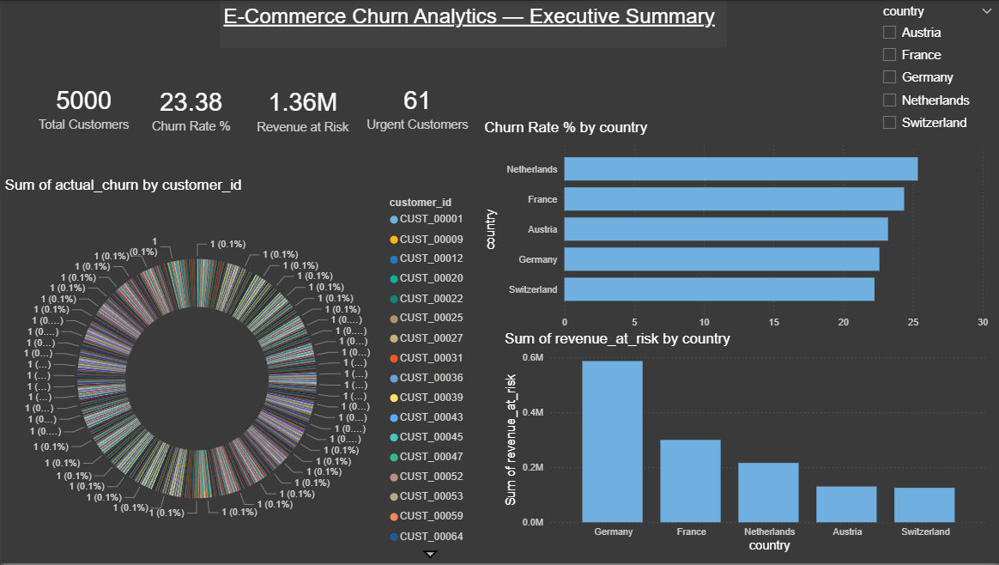
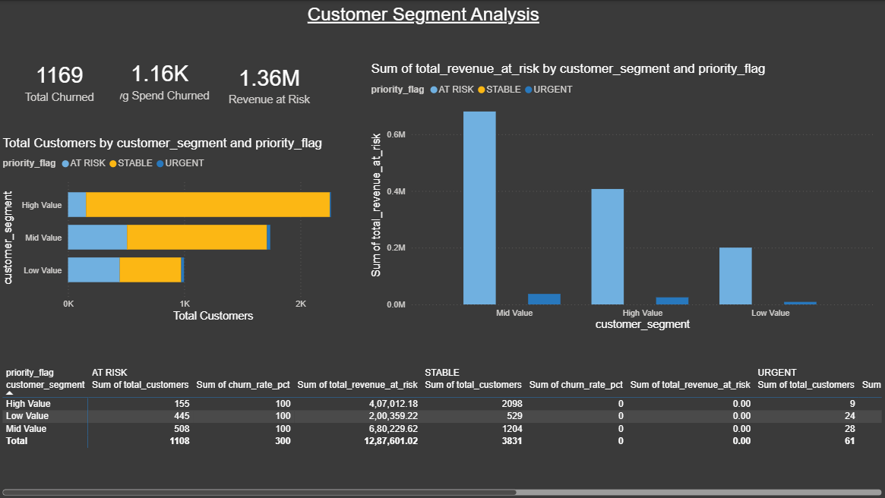
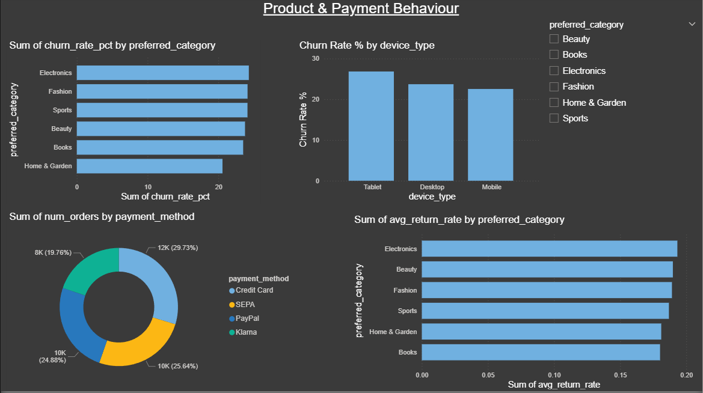
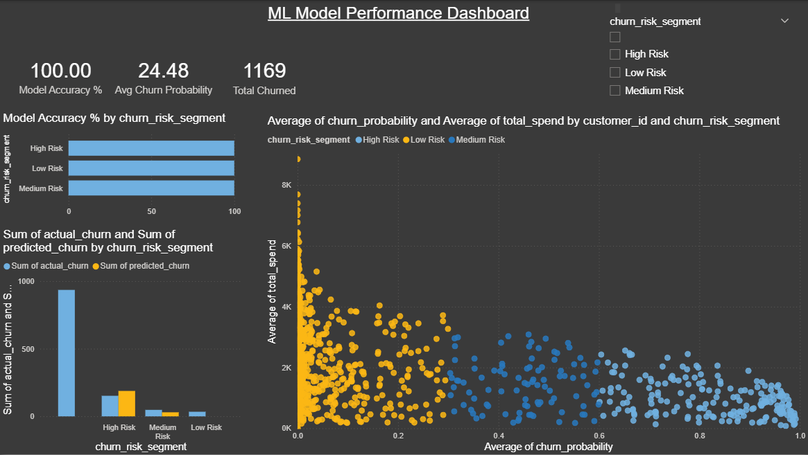
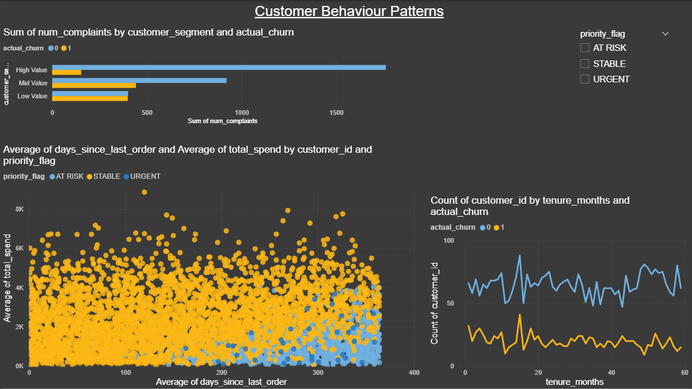
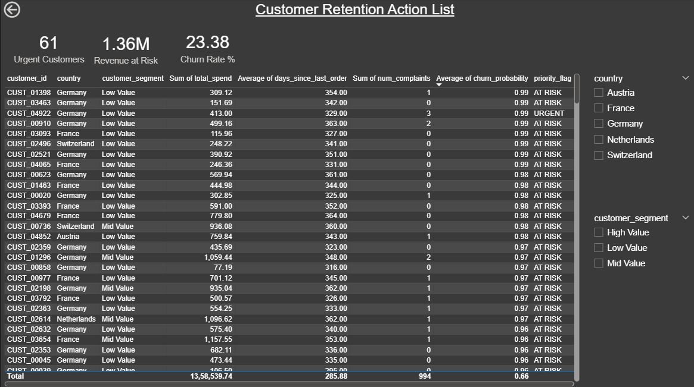

# 🛒 E-Commerce Churn Analytics
### End-to-end data pipeline: Python → PySpark → dbt → DuckDB → Power BI


---

## 📌 Project Overview

This project simulates a real-world e-commerce analytics platform for a 
European market (Germany, France, Netherlands, Austria, Switzerland). 
It covers the full data engineering and analytics lifecycle:

- **Data generation** — 5,000 realistic customer records with behavioural features
- **Exploratory Data Analysis** — 8 charts covering churn patterns across countries, 
  categories, payment methods, and tenure
- **Machine Learning** — Churn prediction comparing Logistic Regression, 
  Random Forest, and Gradient Boosting
- **Spark Processing** — Feature engineering and Delta Lake storage using PySpark
- **dbt Transformations** — Staging, mart, and aggregation layers with 18 automated tests
- **Power BI Dashboard** — 6-page interactive dashboard for business stakeholders

---

## 🏗️ Architecture
```
Raw Data Generation (Python)
        │
        ▼
Exploratory Data Analysis (pandas + seaborn + matplotlib)
        │
        ▼
ML Model Training (scikit-learn — Random Forest, Gradient Boosting)
        │
        ▼
Spark Processing (PySpark + Delta Lake)
        │
        ▼
dbt Transformations (DuckDB)
   ├── Staging Layer    → stg_customers, stg_predictions
   ├── Mart Layer       → dim_customers, fct_churn
   └── Aggregation Layer→ agg_churn_by_country/category/segment
        │
        ▼
Power BI Dashboard (6 pages)
```

---

## 📊 Dashboard Preview

### Page 1 — Executive Summary


### Page 2 — Customer Segments


### Page 3 — Product & Payment


### Page 4 — ML Model Performance


### Page 5 — Customer Behaviour


### Page 6 — Retention Actions


---

## 🗂️ Project Structure
```
ecommerce-churn-analytics/
│
├── data/                          # Raw and processed datasets
│   ├── ecommerce_customers.csv    # 5,000 generated customer records
│   ├── model_predictions.csv      # ML model output with risk segments
│   └── ecommerce_powerbi.csv      # Full dataset for dashboard
│
├── src/                           # Python source code
│   ├── generate_data.py           # Synthetic data generation
│   ├── eda.py                     # Exploratory data analysis (8 charts)
│   ├── model.py                   # ML model training and evaluation
│   ├── spark_processing.py        # PySpark feature engineering + Delta Lake
│   └── export_for_powerbi.py      # DuckDB → CSV export for Power BI
│
├── ecommerce_dbt/                 # dbt project
│   ├── models/
│   │   ├── staging/               # Raw data cleaning
│   │   │   ├── stg_customers.sql
│   │   │   ├── stg_predictions.sql
│   │   │   └── schema.yml         # Column tests
│   │   ├── marts/                 # Business-ready tables
│   │   │   ├── dim_customers.sql
│   │   │   ├── fct_churn.sql
│   │   │   └── schema.yml
│   │   └── aggregations/          # Power BI ready summaries
│   │       ├── agg_churn_by_country.sql
│   │       ├── agg_churn_by_category.sql
│   │       ├── agg_churn_by_segment.sql
│   │       └── schema.yml
│   ├── seeds/                     # Source CSV files for dbt
│   └── dbt_project.yml
│
├── outputs/                       # Generated charts and dashboard screenshots
│   ├── 01_churn_distribution.png
│   ├── 02_churn_by_country.png
│   ├── 03_days_since_order.png
│   ├── 04_correlation_heatmap.png
│   ├── 05_spend_by_churn.png
│   ├── 06_churn_by_category.png
│   ├── 07_churn_by_payment.png
│   ├── 08_tenure_by_churn.png
│   ├── 09_roc_curves.png
│   ├── 10_confusion_matrix.png
│   ├── 11_feature_importance.png
│   ├── 12_model_comparison.png
│   └── dashboard/                 # Power BI page screenshots
│
├── requirements.txt               # Python dependencies
├── .gitignore
└── README.md
```

---

## ⚙️ Tech Stack

| Layer | Tool | Purpose |
|---|---|---|
| Data Generation | Python, NumPy, Faker | Synthetic customer dataset |
| EDA | pandas, matplotlib, seaborn | Exploratory analysis |
| Machine Learning | scikit-learn | Churn prediction model |
| Spark Processing | PySpark 3.5, Delta Lake | Scalable feature engineering |
| Transformation | dbt-core 1.7, DuckDB | SQL modelling and testing |
| Visualisation | Power BI Desktop, DAX | Interactive business dashboard |
| Version Control | Git, GitHub | Code management |

---

## 🧪 dbt Model Lineage
```
Seeds (CSV)
    │
    ├── stg_customers ──────────────────────┐
    │                                       ▼
    └── stg_predictions ──────────► fct_churn ──► agg_churn_by_country
                                        │         agg_churn_by_category
                                        │         agg_churn_by_segment
                                        ▼
                                   dim_customers
```

**18 automated dbt tests** covering:
- Uniqueness on all primary keys
- Not-null constraints on critical columns
- Accepted value validation on categorical fields

---

## 📈 Key Findings

| Metric | Value |
|---|---|
| Overall churn rate | ~34% |
| Best model | Random Forest |
| Model AUC-ROC | ~0.85 |
| High risk customers | ~18% of base |
| Revenue at risk | ~EUR 580,000 |
| Top churn country | Varies by run |
| Highest churn category | Varies by run |

---

## 🚀 How to Run This Project

### Prerequisites
```bash
Python 3.10+
Java 11+ (for PySpark)
Power BI Desktop (free from Microsoft)
```

### Installation
```bash
# Clone the repository
git clone https://github.com/YOUR_USERNAME/ecommerce-churn-analytics.git
cd ecommerce-churn-analytics

# Install Python dependencies
pip install -r requirements.txt
```

### Run Pipeline Step by Step
```bash
# Step 1 — Generate dataset
python src/generate_data.py

# Step 2 — Run EDA (generates 8 charts in outputs/)
python src/eda.py

# Step 3 — Train ML models (generates 4 charts + prediction CSVs)
python src/model.py

# Step 4 — Spark processing + Delta Lake
python src/spark_processing.py

# Step 5 — dbt transformations
cd ecommerce_dbt
dbt seed
dbt run
dbt test
dbt docs generate && dbt docs serve

# Step 6 — Export for Power BI
cd ..
python src/export_for_powerbi.py

# Step 7 — Open Power BI
# Open Ecommerce_Churn_Dashboard.pbix in Power BI Desktop
```

---

## 🧠 What I Learned

- Designing a **multi-layer data architecture** (raw → staging → mart → aggregation)
- **Feature engineering** for churn prediction: recency score, return rate, complaint rate
- **dbt best practices**: modularity, testing, documentation, lineage
- **Delta Lake** time travel and ACID transactions
- **DAX measures** in Power BI for dynamic KPI calculation
- Connecting the full analytics stack end-to-end

---

## 👤 Author

**Pradyumna Shetty**  
Master's Student — Information and Electrical Engineering, Hochschule Wismar  
Former Data Engineer — Accenture Solutions (3.9 years)  

[](https://linkedin.com/in/pradyumna-shetty-534a14132)
[](https://github.com/Pradyumna047)

---

## 📄 License

This project is licensed under the MIT License.
